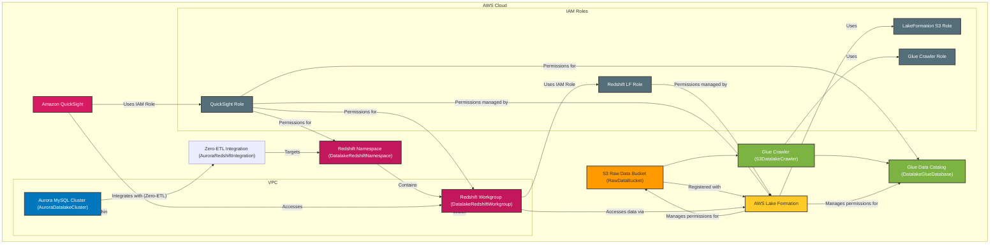

```mermaid
graph TD
    subgraph "AWS Cloud"
        subgraph "VPC"
            AuroraCluster["Aurora MySQL Cluster (AuroraDatalakeCluster)"]
            RedshiftWorkgroup["Redshift Workgroup (DatalakeRedshiftWorkgroup)"]
        end

        S3Bucket["S3 Raw Data Bucket (RawDataBucket)"]
        GlueDatabase["Glue Data Catalog (DatalakeGlueDatabase)"]
        GlueCrawler["Glue Crawler (S3DatalakeCrawler)"]
        LakeFormation["AWS Lake Formation"]
        RedshiftNamespace["Redshift Namespace (DatalakeRedshiftNamespace)"]
        QuickSight["Amazon QuickSight"]
        ZeroETL["Zero-ETL Integration (AuroraRedshiftIntegration)"]

        subgraph "IAM Roles"
            LakeFormationS3Role["LakeFormation S3 Role"]
            GlueS3CrawlerRole["Glue Crawler Role"]
            RedshiftDataLakeAccessRole["Redshift LF Role"]
            QuickSightRole["QuickSight Role"]
        end

        %% Define relationships
        S3Bucket --> GlueCrawler
        GlueCrawler --> GlueDatabase
        GlueCrawler -- Uses --> GlueS3CrawlerRole
        S3Bucket -- Registered with --> LakeFormation
        LakeFormation -- Manages permissions for --> S3Bucket
        LakeFormation -- Manages permissions for --> GlueDatabase
        LakeFormation -- Uses --> LakeFormationS3Role

        AuroraCluster -- Within --> VPC
        AuroraCluster -- Integrates with (Zero-ETL) --> ZeroETL
        ZeroETL -- Targets --> RedshiftNamespace

        RedshiftNamespace -- Contains --> RedshiftWorkgroup
        RedshiftWorkgroup -- Within --> VPC
        RedshiftWorkgroup -- Accesses data via --> LakeFormation
        RedshiftWorkgroup -- Uses IAM Role --> RedshiftDataLakeAccessRole
        RedshiftDataLakeAccessRole -- Permissions managed by --> LakeFormation

        QuickSight -- Accesses --> RedshiftWorkgroup
        QuickSight -- Uses IAM Role --> QuickSightRole
        QuickSightRole -- Permissions managed by --> LakeFormation
        QuickSightRole -- Permissions for --> GlueDatabase
        QuickSightRole -- Permissions for --> RedshiftNamespace
        QuickSightRole -- Permissions for --> RedshiftWorkgroup

        %% Styling (optional, but good for clarity)
        classDef s3 fill:#f90,stroke:#333,stroke-width:2px;
        classDef rds fill:#0277bd,stroke:#333,stroke-width:2px,color:#fff;
        classDef redshift fill:#c2185b,stroke:#333,stroke-width:2px,color:#fff;
        classDef glue fill:#7cb342,stroke:#333,stroke-width:2px,color:#fff;
        classDef lf fill:#ffca28,stroke:#333,stroke-width:2px;
        classDef iam fill:#546e7a,stroke:#333,stroke-width:2px,color:#fff;
        classDef qs fill:#d81b60,stroke:#333,stroke-width:2px,color:#fff;

        class S3Bucket s3;
        class AuroraCluster rds;
        class RedshiftNamespace,RedshiftWorkgroup redshift;
        class GlueDatabase,GlueCrawler glue;
        class LakeFormation lf;
        class LakeFormationS3Role,GlueS3CrawlerRole,RedshiftDataLakeAccessRole,QuickSightRole iam;
        class QuickSight qs;
    end
```
